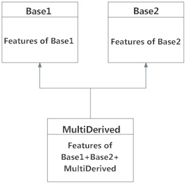
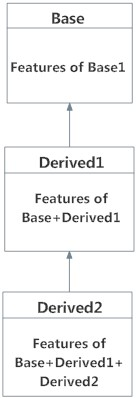
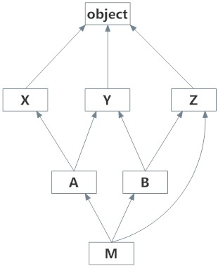

# Inheritance

##### Inheritance is the capability of one class to derive or inherit the properties from some another class. 
The benefits of inheritance are:
1. It provides reusability of a code. We don’t have to write the same code again and again. Also, it allows us to add more features to a class without modifying it.
2. It is transitive in nature, which means that if class B inherits from another class A, then all the subclasses of B would automatically inherit from class A.

Python Inheritance Syntax

```python
class BaseClass:
  Body of base class
class DerivedClass(BaseClass):
  Body of derived class
```

Different forms of Inheritance:
1. Single inheritance: When a child class inherits from only one parent class, it is called as single inheritance. We saw an example above.
2. Multiple inheritance: A class can be derived from more than one base classes in Python. This is called multiple inheritance.
In multiple inheritance, the features of all the base classes are inherited into the derived class. The syntax for multiple inheritance is similar to single inheritance.

```python
class Base1:
    pass

class Base2:
    pass

class MultiDerived(Base1, Base2):
    pass
```

Here, MultiDerived is derived from classes Base1 and Base2.
 


The class MultiDerived inherits from both Base1 and Base2.

3. Multilevel inheritance:  We can also inherit form a derived class. This is called multilevel inheritance. It can be of any depth in Python.

In multilevel inheritance, features of the base class and the derived class is inherited into the new derived class.


```python
class Base:
    pass

class Derived1(Base):
    pass

class Derived2(Derived1):
    pass
```

Here, Derived1 is derived from Base, and Derived2 is derived from Derived1.

 

#### Method Resolution Order (MRO)

 
